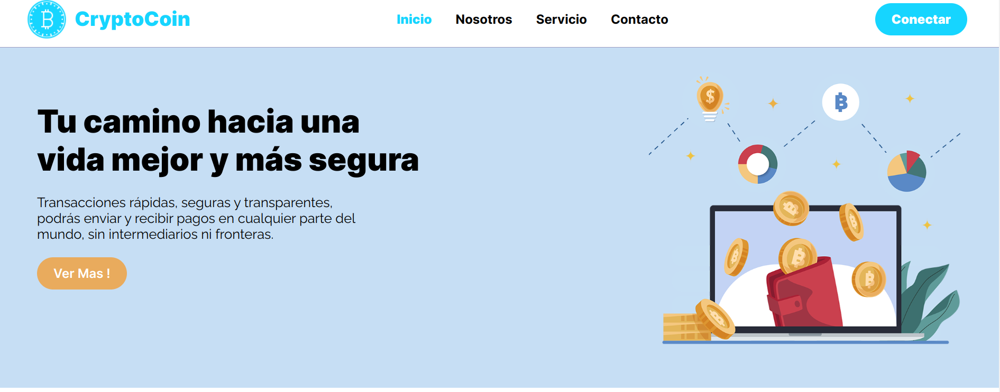

# Proyecto del módulo de Diseño Web.

- El proyecto consiste en diseñar y desarrollar un sitio web de Criptomoneda, el objetivo es crear una plataforma en línea atractiva y funcional y atraiga a los clientes potenciales.
El sitio web contendrá varias secciones, como una página de inicio que destaque los productos y servicios ofrecidos, una página de contacto con información de ubicación y horarios, y una sección de "Acerca de nosotros" que narre la historia y valores de la plataforma.

- La funcionalidad del sitio web será fácil de usar y accesible en diferentes dispositivos, incluidos teléfonos móviles y tabletas. Se prestará especial atención a la optimización para mejorar la experiencia del usuario y aumentar la conversión.

- El proyecto del módulo de Diseño Web incluirá la creación de maquetas (mockups) y prototipos interactivos para permitir una revisión y feedback adecuados antes de proceder a la fase de desarrollo. Además, se considerarán las buenas prácticas de diseño web, la usabilidad y la accesibilidad para garantizar un sitio web de alta calidad.

## Tecnologías utilizadas

- **HTML5 y CSS3**: Para la estructura y el diseño del sitio web.
# coin
